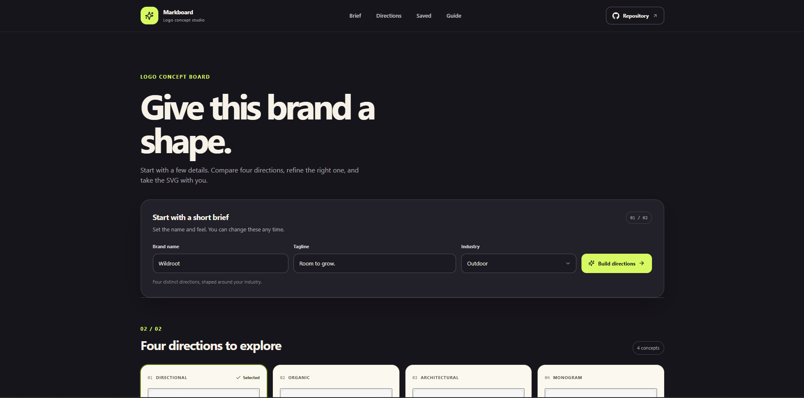

# Logo Concept Board

Logo Concept Board is a small brand identity workbench. Write a short brand brief, compare four logo directions, refine one, then copy or download the artwork as SVG.

**Live site:** [https://a2rp.github.io/logo-concept-board/](https://a2rp.github.io/logo-concept-board/)

## What is included

- A fixed header with links to the brief, directions, saved concepts, and guide. The Repository link opens this project's public GitHub repository.
- A brief form for the brand name, tagline, and industry. The industry helps choose from a curated set of logo directions.
- Four visual directions at a time, with different marks such as a compass, leaf, ridge, monogram, orbit, bloom, arch, and signal. Select a direction to refine it. Build another set to compare additional marks for the same industry.
- A live preview that follows changes to the name and tagline in the brief.
- Four color palettes, three type treatments, and horizontal or stacked logo lockups.
- A saved-concepts shelf that stores a snapshot of the brand, direction, palette, type, and layout. Apply a saved direction to restore it to the editor. Removing a saved direction asks for confirmation.
- SVG markup that can be inspected or copied, plus a Download action for a transparent SVG file.
- A short guide, a two-sided footer with profile and support links, responsive layouts, and a Back to top control after scrolling more than 50px.

## Use the board

1. Enter a brand name, tagline, and industry.
2. Select **Build directions** to create four options. Select a card to open it in the editor.
3. Choose a palette, type style, and lockup. The preview and direction cards update as you make changes.
4. Select **Save direction** to keep the current version in Saved concepts. Select **Apply to board** later to restore its brief and design settings.
5. Select **Copy SVG** to copy the markup or **Download** to save the current logo as an SVG file.

The directions use a small, curated library of reusable vector marks. Building another set selects a different group of marks for the chosen industry. It does not call an external service.

## Data and export notes

Saved directions are kept in this browser's local storage under `logo-concept-board-saved-directions`. They remain on the current device and browser, are not shared between visitors, and are removed if the site's storage is cleared. If local storage is blocked, the editor and exports still work for the current session, but saved directions do not persist.

SVG files have a transparent background. Brand names and taglines remain SVG text, so the viewing application uses an available font from the exported font-family list. The artwork is not converted to font outlines. The project exports SVG; it does not export PNG files.

## Run locally

Use a current Node.js version, then run these commands from this folder:

```sh
npm install
npm run dev
```

Open the local address printed by Vite.

## Lint, build, and deploy

```sh
npm run lint
npm run build
npm run deploy
```

The deploy command builds the app and publishes `dist` to the `gh-pages` branch. The app uses `/logo-concept-board/` as its Vite base path. The deployed site is [https://a2rp.github.io/logo-concept-board/](https://a2rp.github.io/logo-concept-board/). Do not commit the generated `dist` folder to `main`.

## Future improvements

These are ideas for later work and are not implemented:

- Add more mark families and industry-specific direction sets.
- Offer custom color entry and background previews for light and dark use.
- Export the selected logo in additional file formats and sizes.
- Add a shareable link for a saved brief and logo direction.
- Convert wordmarks to vector outlines for font-independent export.

## Links

- Portfolio: [https://www.ashishranjan.net](https://www.ashishranjan.net)
- GitHub: [https://github.com/a2rp](https://github.com/a2rp)
- CodePen: [https://codepen.io/ash1198](https://codepen.io/ash1198)
- LinkedIn: [https://www.linkedin.com/in/aashishranjan](https://www.linkedin.com/in/aashishranjan)
- Facebook: [https://www.facebook.com/theash.ashish/](https://www.facebook.com/theash.ashish/)
- YouTube: [https://www.youtube.com/@ashishranjan-ashz?sub_confirmation=1](https://www.youtube.com/@ashishranjan-ashz?sub_confirmation=1)
- Email: [mailto:ash.ranjan09@gmail.com](mailto:ash.ranjan09@gmail.com)

## Support

- Support: [https://a2rp-donation-page.netlify.app/](https://a2rp-donation-page.netlify.app/)
- Buy Me a Coffee: [https://buymeacoffee.com/ashishranjan](https://buymeacoffee.com/ashishranjan)
- Patreon: [https://www.patreon.com/ashishranjan](https://www.patreon.com/ashishranjan)
